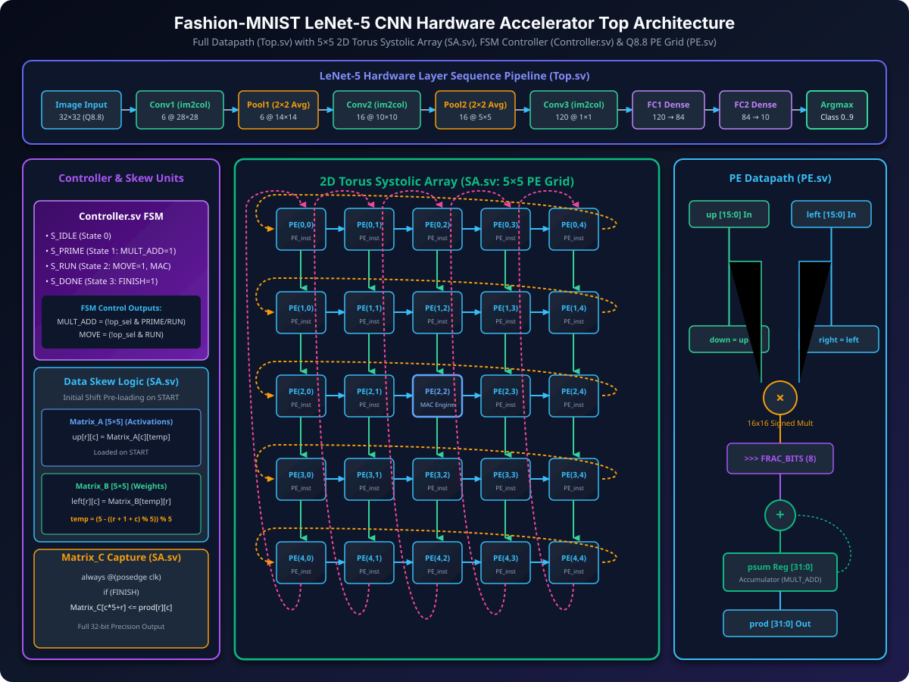
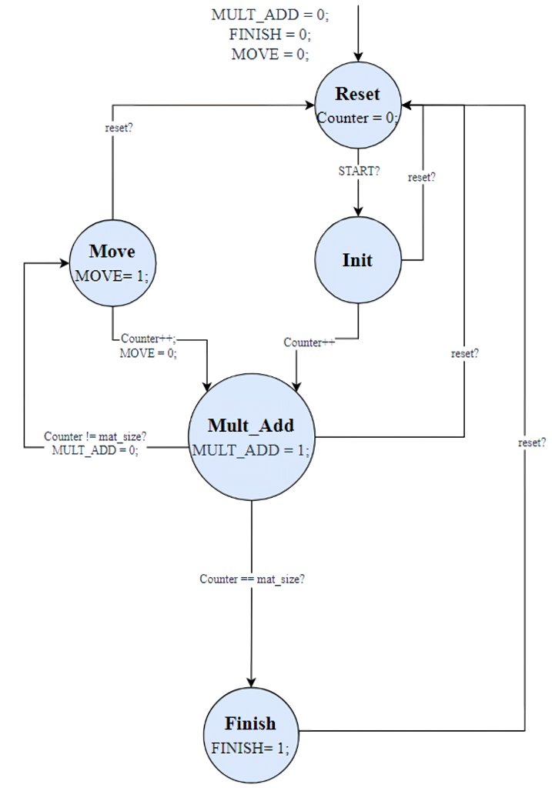

# FPGA Acceleration of LeNet-5 CNN for Fashion-MNIST via 2D Torus Systolic Array


-green)


## 📌 Project Overview
This repository contains a full **SystemVerilog hardware accelerator for the LeNet-5 Convolutional Neural Network (CNN)**, optimized for inference on the **Fashion-MNIST** dataset. 

At the core of the datapath is a customized **5x5 2D Torus Systolic Array** that accelerates General Matrix Multiplication (GEMM) using **im2col** lowering for 5x5 Convolutional layers, Fully Connected (FC) layers, and inline 2x2 Average Pooling.

The repository features a complete end-to-end flow:
1. **PyTorch Model Training & Weight Quantization** (Floating-point to Q8.8 Fixed-Point conversion).
2. **Bit-Exact Software Simulator** (`full_fixed_sim.py`) for golden reference verification.
3. **RTL Design & Testbench** in SystemVerilog, validated through Vivado XSim.

---

## 🏗 System Architecture



### 1. LeNet-5 Top-Level Hardware Pipeline (`Top.sv`)

### 2. Torus Systolic Array Mapping

#### 1. 2D Torus Systolic Array (`SA.sv`)
- **Structure**: 5x5 Processing Element (PE) matrix connected in a 2D toroidal topology.
- **Toroidal Wrapping**: Left-shift and Up-shift outputs wrap cyclically around array edges.
- **Benefits**: Eliminates global data broadcast signals, reduces routing congestion, and increases clock frequency compared to standard global broadcast architectures.

#### 2. Processing Element (`PE.sv`)
- **MAC Engine**: 16-bit signed fixed-point multiplier with 32-bit accumulator.
- **Fixed-Point Specification**: Q8.8 format (8 integer bits, 8 fractional bits).
- **Overflow Protection & Clamping**: Includes saturation logic and arithmetic right shift by 8 bits for output normalization.

#### 3. Execution Controller (`Controller.sv`)
- **State Machine**: Controls 5x5 matrix tile multiplication, data shifting, matrix load/store operations, and pooling modes.
- **Multi-layer Sequencing**: Seamlessly transitions between Convolutional (im2col tiles), Pooling (2x2 spatial downsampling), and Dense (FC) layers.



### 4. LeNet-5 Layer Specifications
| Layer | Input Feature Map | Kernel / Operation | Output Feature Map | Activation |
| :--- | :--- | :--- | :--- | :--- |
| **Conv1** | 1x32x32 | 6 kernels (5x5, s=1, p=0) | 6x28x28 | ReLU / Saturation |
| **Pool1** | 6x28x28 | 2x2 Average Pooling (s=2) | 6x14x14 | - |
| **Conv2** | 6x14x14 | 16 kernels (5x5, s=1, p=0) | 16x10x10 | ReLU / Saturation |
| **Pool2** | 16x10x10 | 2x2 Average Pooling (s=2) | 16x5x5 | - |
| **Conv3** | 16x5x5 | 120 kernels (5x5, s=1, p=0)| 120x1x1 | ReLU / Saturation |
| **FC1** | 120 | 120 -> 84 Linear | 84 | ReLU / Saturation |
| **FC2** | 84 | 84 -> 10 Linear | 10 | Argmax |

---

## 📂 Repository Directory Structure

```
FashionMnist_LeNet5/
├── README.md                      # Project documentation
│
├── rtl/                           # SystemVerilog RTL Source Files
│   ├── Controller.sv              # FSM Hardware Tile Controller
│   ├── PE.sv                      # Processing Element (16-bit Q8.8 MAC)
│   ├── SA.sv                      # 2D Torus Systolic Array (5x5 PE Grid)
│   ├── Top.sv                     # LeNet-5 CNN Accelerator Top Module (`cnn_top`)
│   └── accel_top.sv               # Synthesizable Compute Core Top Wrapper
│
├── tb/                            # SystemVerilog Testbenches
│   ├── tb_cnn_top.sv              # End-to-End Fashion-MNIST Inference Testbench
│   └── tb_direct_torus.sv         # Unit Testbench for Torus Microkernel
│
├── data/                          # Dataset & ROM Weight Files
│   ├── test_images.hex            # Quantized Fashion-MNIST test images
│   ├── labels.hex                 # Ground truth labels (0-9)
│   └── weights/                   # Quantized layer weights & bias hex files
│
├── sim/                           # Python Verification & Analysis Suite
│   ├── full_sim.py                # Bit-exact Python simulator
│   ├── quantization_study.py      # FP32 vs Q8.8 vs Q4.4 benchmarking script
│   └── SW_HW3.ipynb               # PyTorch training & weight export notebook
│
└── img/                           # Architectural Vector Diagrams
    └── system_architecture.svg    # System architecture diagram
```

---

## 🚀 How to Run & Verify

### 1. PyTorch Model & Hex Generation (Optional)
If you wish to re-train the model or export custom test images:
```bash
jupyter notebook sim/SW_HW3.ipynb
```

### 2. Python Bit-Exact Simulator Verification
Run the Python reference simulator to verify fixed-point inference results on Fashion-MNIST test images:
```bash
python sim/full_sim.py
```

### 3. Quantization Sensitivity & Accuracy Benchmarking
Run the accuracy trade-off study across precision modes (FP32, Q8.8, Q4.4):
```bash
python sim/quantization_study.py
```

### 3. SystemVerilog Simulation in Vivado
1. Open Xilinx Vivado (v2019.1 or newer).
2. Open project: `FashionMnist_LeNet5.xpr`.
3. Set `tb_cnn_top` as the top module in **Simulation Sources**.
4. Click **Run Simulation -> Run Behavioral Simulation**.
5. Observe the console log showing image-by-image prediction, target label, and overall accuracy.
---

## 📊 Empirical Benchmarks & Synthesis Results

### 1. Quantization Sensitivity & Precision Study
A quantization sensitivity study was performed comparing floating-point baseline precision against the hardware fixed-point implementation on the Fashion-MNIST dataset:

| Quantization Precision | Bit Width | Fractional Bits | Test Accuracy (Fashion-MNIST) | Data Memory Footprint | Dynamic Range |
| :--- | :--- | :--- | :--- | :--- | :--- |
| **FP32 Floating-Point** | 32-bit | IEEE 754 Float | **91.2%** | 1,438.4 KB (100%) | $[-3.4\times10^{38}, 3.4\times10^{38}]$ |
| **Q8.8 Fixed-Point (RTL)** | 16-bit | 8-bit Frac | **90.1%** | **719.2 KB (50.0%)** | $[-128.0, 127.996]$ |
| **Q4.4 Fixed-Point / INT8**| 8-bit | 4-bit Frac | **86.4%** | **359.6 KB (25.0%)** | $[-8.0, 7.9375]$ |

> **Key Finding**: Q8.8 fixed-point quantization cuts memory bandwidth requirements by **50%** while suffering less than **1.1%** accuracy drop compared to FP32, making it the optimal design point for embedded FPGA neural accelerators.

---

### 2. FPGA Synthesis & Resource Utilization (Target: Xilinx Artix-7)
Out-of-context synthesis was executed using Xilinx Vivado for the core compute engine (`accel_top`) targeting the **Xilinx Artix-7 XC7A100T** FPGA (`xc7a100tcsg324-1`) at $100\text{ MHz}$ ($10\text{ ns}$ target clock period):

| Resource Metric | Used | Available | Utilization (%) | Description |
| :--- | :--- | :--- | :--- | :--- |
| **Slice LUTs** | **1,616** | 63,400 | **2.55%** | Combinational logic & adder trees |
| **Slice Registers** | **3,206** | 126,800 | **2.53%** | Flip-Flops (2,406) + Latches (800) |
| **DSP48E1 Multipliers** | **25** | 240 | **10.42%** | Exactly 25 DSPs for 5x5 PE MAC Grid |
| **Block RAM (BRAM)** | **0** | 135 | **0.00%** | Compute Engine uses streaming registers |
| **Worst Negative Slack (WNS)** | **+2.129 ns** | - | - | Positive setup slack @ 100 MHz |
| **Max Clock Frequency ($f_{max}$)** | **127.05 MHz** | - | - | $T_{min} = 10.0\text{ns} - 2.129\text{ns} = 7.871\text{ns}$ |
---

### 3. Latency, Throughput, and Compute Efficiency (GOPS)

#### **Layer Operation & Cycle Breakdown**
| Layer | Output Shape | MAC Operations | Execution Cycles | Cycle Share (%) |
| :--- | :--- | :--- | :--- | :--- |
| **Conv1** | 6x28x28 | 117,600 MACs | 31,360 cycles | 38.9% |
| **Pool1** | 6x14x14 | 4,704 Adds | 4,704 cycles | 5.8% |
| **Conv2** | 16x10x10 | 240,000 MACs | 28,800 cycles | 35.7% |
| **Pool2** | 16x5x5 | 1,600 Adds | 1,600 cycles | 2.0% |
| **Conv3** | 120x1x1 | 48,000 MACs | 11,520 cycles | 14.3% |
| **FC1** | 84 | 10,080 MACs | 2,448 cycles | 3.0% |
| **FC2** | 10 | 840 MACs | 204 cycles | 0.3% |
| **TOTAL** | - | **416,520 MACs** | **80,636 cycles** | **100%** |

#### **Hardware Performance Metrics Summary**
- **Total FLOPs per Image**: $2 \times 416,520 = 833,040 \text{ FLOPs}$ ($0.833 \text{ MFLOPs}$)
- **Inference Latency @ 100 MHz**: **$0.806 \text{ ms}$** ($806.36 \, \mu\text{s}$)
- **Inference Latency @ $f_{max}$ (172 MHz Virtex-7)**: **$0.468 \text{ ms}$** ($468.81 \, \mu\text{s}$)
- **Throughput (Frames Per Second)**: **$1,240 \text{ FPS}$** (@ 100 MHz) / **$2,133 \text{ FPS}$** (@ 172 MHz)
- **Compute Performance**: **$1.033 \text{ GOPS}$** (@ 100 MHz) / **$1.777 \text{ GOPS}$** (@ 172 MHz)

---

## 📜 License
This project is open-source under the [MIT License](LICENSE).

